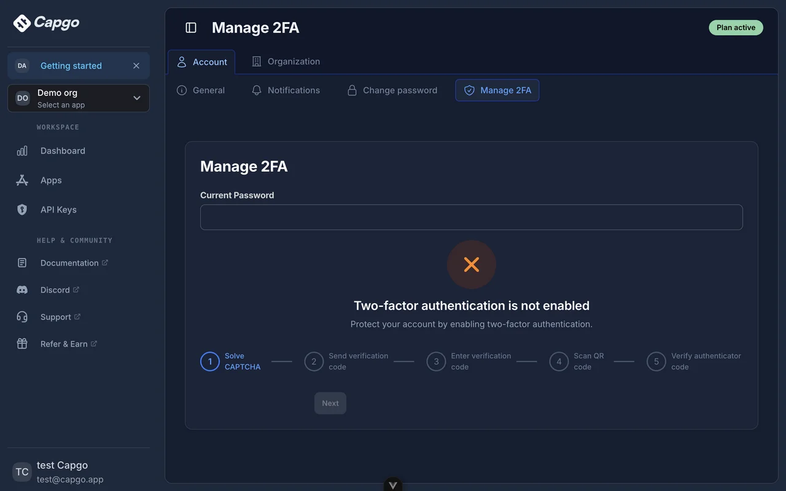

# Console authentication cutover

The console uses Better Auth behind Capgo's `/auth` API. Browser data, image,
billing, organization, security, and CLI event requests go through Capgo's API.
The Vite build rejects Supabase SDK modules in the browser bundle.

This is the authentication and console-interface migration. The database is
still PostgreSQL: existing RLS and published CLI contracts remain in place.
Capgo translates a validated console session into a short-lived internal JWT
for RLS; the browser receives an opaque Better Auth session token. The internal
JWT is never returned to the browser. Moving the database to PlanetScale is a
separate change after these interfaces have shipped.

## Configuration

Configure the API worker before switching the console:

- `CONSOLE_AUTH_URL`: public API root, such as `https://api.capgo.app`. For the
  Edge Functions deployment, include `/functions/v1`. Do not append `/auth`.
- `WEBAPP_URL`: console origin, used for trusted redirects and requests.
- `BETTER_AUTH_SECRET`: stable secret of at least 32 characters. The import
  command must use the same secret as the runtime; it encrypts TOTP factors.
- `JWT_SECRET`: existing database JWT secret, for the server-only RLS bridge.
- `CAPTCHA_SECRET_KEY`: existing Turnstile secret.
- `CONSOLE_TRUSTED_ORIGINS`: optional comma-separated additional console
  origins. Native Capacitor/Ionic localhost origins are already allowed.
- Email delivery: use the API worker's existing `AUTH_EMAIL` binding, or set
  `CONSOLE_SMTP_URL` for an SMTP deployment. Check confirmation, reset, and OTP
  deliveries in staging. Production requires email verification by default.

The API worker also needs the `CONSOLE_EVENTS` Durable Object binding and its
SQLite migration from `wrangler.jsonc`. Streams reauthenticate every 30 seconds;
membership changes and revoked sessions take effect on reconnect. Existing
Supabase broadcasts continue for compatibility with older clients.

## Import and rollout

1. Apply the database migration to a restored backup first. Set
   `SUPABASE_DB_URL`, `BETTER_AUTH_SECRET`, and `CONSOLE_AUTH_URL` in the process
   environment. If GoTrue encrypts database fields, supply its
   `GOTRUE_SECURITY_DB_ENCRYPTION_DECRYPTION_KEYS` JSON key map as well. Keep
   these values out of command history and source control.
2. Run `bun scripts/migrate-console-auth.ts`. Dry-run is the default. It reads
   users in bounded primary-key batches and reports counts only. It rejects
   duplicate email identities, unsupported password hashes, unsupported or
   multiple verified factors, missing decryption keys, and unsupported SAML
   mappings. Reconcile those cases before proceeding.
3. Run `bun scripts/migrate-console-auth.ts --apply` on the restored backup.
   UUIDs and bcrypt hashes are preserved. Imported TOTP factors keep their
   existing authenticator codes through an explicit Base32 compatibility
   adapter; native challenge consumption and lockouts still apply. Existing
   Better Auth credentials are never overwritten on rerun.
4. Test password login, confirmation, reset, MFA enrollment and login,
   invitations, account removal, organization permissions, and each enterprise
   IdP. Update each IdP's entity ID and ACS URL using its provider-specific
   metadata from the console. Signed SAML claims and the verified domain must
   both match the active Capgo provider before an account can be linked.
   Metadata URL imports use the Cloudflare API; other deployments require
   uploaded XML so they cannot fetch a private address after a DNS change.
5. During the production cutover window, pause identity/password/factor/SSO
   configuration changes, apply the migration, repeat the dry-run, and import.
   Import writes commit per user, so a failed apply can leave a partial import;
   resolve its cause and rerun before opening the console. Switch API and
   console together after validating email delivery and IdP configuration.
6. Existing console sessions require a fresh login. Existing published CLI
   API keys keep their RPC grants. New and changed console passwords are also
   mirrored into the transitional `auth.users` identity row so legacy password
   login remains available. MFA-protected users should use browser CLI login
   when their factor exists only in Better Auth.

The `auth.users` mirror preserves current foreign keys, bans, account removal,
and CLI compatibility. Better Auth owns console credentials, factors, and
sessions. Deleting the legacy identity cascades its Better Auth identity;
disabling MFA through the verified console flow removes migrated legacy
factors too. These bridges can be removed with the later database/CLI cutover.

## Rollback

Keep the pre-cutover database backup and IdP metadata. A console rollback needs
the matching API deployment and old IdP ACS/entity IDs. Password changes are
mirrored, but new Better Auth factors and SSO account bindings are not imported
back into GoTrue automatically. Reconcile those changes before reopening the
old console; do not bypass MFA to recover accounts.

## Database execution model

`verify_mfa()` is reached by authenticated RLS callers. Its restrictive policies
use a scalar subquery, producing one InitPlan per statement. Native identity
lookups use `console_auth_user_pkey`; legacy factor lookups use the existing
user-indexed MFA table. `has_2fa_enabled(uuid)` remains service-role-only and
is also called by existing authorized org/RBAC functions. Each call uses one
caller/principal UUID, never an enumeration of native identities. The `()`
overload uses `auth.uid()`. Account deletion runs once per deleted identity and
uses native identity/session/account/factor indexes for cascades.

Password login checks SSO enforcement once after credential verification using
an indexed domain lookup. The existing recovery permission check receives one
verified user UUID and one provider org UUID; it does not enumerate users or
organizations. Members of enforced SSO domains must sign in through their IdP.

The console normally serves roughly 500–1,000 end users. Local
`EXPLAIN (ANALYZE, BUFFERS)` checks with 10,000 additional native identities, 100 caller-owned orgs, and 1,000 apps
showed an index scan on `console_auth_user_pkey` (0.024 ms). Unfiltered and
filtered org reads were checked for anonymous, invalid API key, broad API key,
native user, and legacy user roles. Their plans included InitPlans. Eight
parallel app reads alongside a lightweight org read completed in 24.7 ms.
These are local measurements, not production latency guarantees. No plugin
request path imports Better Auth or performs a new primary-database lookup.

## Live console evidence

Better Auth requires the current password for MFA changes on credential
accounts. SSO-only accounts use their authenticated SSO session.

